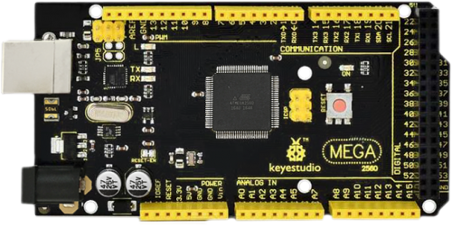
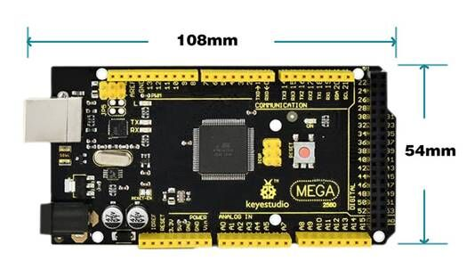
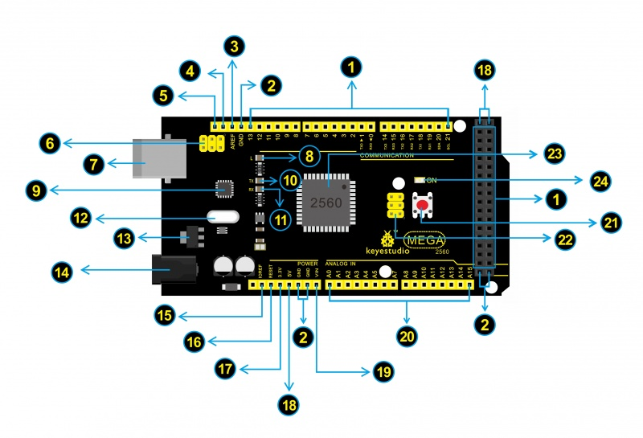

# Ks0002 keyestudio Mega 2560 R3 Development Board

## Introduction:

Keyestudio Mega 2560 R3 is a microcontroller board based on the ATMEGA2560-16AU , fully compatible with ARDUINO MEGA 2560 REV3.
It has 54 digital input/output pins (of which 15 can be used as PWM outputs), 16 analog inputs, 4 UARTs (hardware serial ports), a 16 MHz crystal oscillator, a USB connection, a power jack, 2 ICSP headers, and a reset button.
It contains everything needed to support the microcontroller. With its bootloader, program can be downloaded directly with USB and you don’t need to use other external programmer.
Just simply connect it to a computer with a USB cable or power it with a AC-to-DC adapter or battery to get started.
The Mega 2560 board is compatible with most shields designed for the Uno.
The 2560 R3 differs from all preceding boards in that it does not use the FTDI USB-to-serial driver chip. Instead, it features the Atmega16U2 programmed as a USB-to-serial converter.
The MEGA 2560 is designed for more complex projects. With 54 digital I/O pins, 16 analog inputs and a larger space for your sketch, it is the recommended board for 3D printers and robotics projects. This gives your projects plenty of room and opportunities.

## Design of Power Supply

There are two choices (direct power supply trough USB or external power supply) for the power supply system of Arduino Mega, and they can be automatically switched. External power supply can be AC-to-DC adapter or battery. Voltage input of this control board is 6V~12V, but if the supplied voltage is greater than 12V, the voltage stabilizing device will be likely to be overheated to damage Arduino MEGA. So we suggest the power supply should be 6.5~12V in operation and recommended supply is 7.5 or 9V.

## keyestudio

The 2560 R3 differs from all preceding boards in that it does not use the FTDI USB-to-serial driver chip. Instead, it features the Atmega16U2 programmed as a USB-to-serial converter.

The MEGA 2560 is designed for more complex projects. With 54 digital I/O pins, 16 analog inputs and a larger space for your sketch, it is the recommended board for 3D printers and robotics projects. This gives your projects plenty of room and opportunities.

## PCB Dimensions

## Element and Pin Interfaces

Here is an explanation of what every element and interface of the board does:

|                   | **Digital I/O**Arduino MEGA has 54 digital input/output pins (of which 15 can be used as PWM outputs). These pins can be configured as digital input pin to read the logic value (0 or 1). Or used as digital output pin to drive different modules like LED, relay, etc. Using [pinMode()](https://www.arduino.cc/reference/en/language/functions/digital-io/pinmode/), [digitalWrite()](https://www.arduino.cc/reference/en/language/functions/digital-io/digitalwrite/), and [digitalRead()](https://www.arduino.cc/reference/en/language/functions/digital-io/digitalread/) functions. |
| ------------------------------------------------------------ | ------------------------------------------------------------ |
|                                           | **GND**Ground pins                                           |
|  | **AREF**Reference voltage (0-5V) for analog inputs. Used with [analogReference()](https://www.arduino.cc/reference/en/language/functions/analog-io/analogreference/). Configures the reference voltage used for analog input (i.e. the value used as the top of the input range). |
|  | **SDA**IIC communication pin                                 |
|                             | **SCL**IIC communication pin                                 |
|  | **ICSP (In-Circuit Serial Programming) Header**the AVR, an Arduino micro-program header consisting of MOSI, MISO, SCK, RESET, VCC, and GND. Connected to the ATMEGA16U2-MU. When connecting to PC, program the firmware to ATMEGA16U2-MU. |
|  | **USB Connection**Arduino board can be powered via USB connector. All you needed to do is connecting the USB port to PC using a USB cable. |
|  | **D13 LED**There is a built-in LED driven by digital pin 13. When the pin is HIGH value, the LED is on, when the pin is LOW, it's off. |
|  | **ATMEGA 16U2-MU**USB to serial chip, can convert the USB signal into serial port signal. |
|  | **TX LED**Onboard you can find the label: TX (transmit) When Arduino board communicates via serial port, send the message, TX led flashes. |
|  | **RX LED**Onboard you can find the label: RX(receive ) When Arduino board communicates via serial port, receive the message, RX led flashes. |
|  | **Crystal Oscillator**How does Arduino calculate time? by using a crystal oscillator. The number printed on the top of the Arduino crystal is 16.000H9H. It tells us that the frequency is 16,000,000 Hertz or 16MHz. |
|  | **Voltage Regulator**To control the voltage provided to the Arduino board, as well as to stabilize the DC voltage used by the processor and other components. Convert an external input DC7-12V voltage into DC 5V, then switch DC 5V to the processor and other components. |
|  | **DC Power Jack**Arduino board can be supplied with an external power DC7-12V from the DC power jack. |
|  | **IOREF**This pin on the board provides the voltage reference with which the microcontroller operates. A properly configured shield can read the IOREF pin voltage and select the appropriate power source or enable voltage translators on the outputs for working with the 5V or 3.3V. |
|  | **RESET Header**Connect an external button to reset the board. The function is the same as reset button. |
|  | **Power Pin 3V3**A 3.3 volt supply generated by the on-board regulator. Maximum current draw is 50 mA. |
|  | **Power Pin 5V**Provides 5V output voltage                   |
|  | **Vin**You can supply an external power input DC7-12V through this pin to Arduino board. |
|  | **Analog Pins**Onboard has 16 analog inputs, labeled A0 to A15. |
|  | **RESET Button**You can reset your Arduino board, for example, start the program from the initial status. You can use the RESET button. |
|  | **ICSP (In-Circuit Serial Programming) Header**the AVR, an Arduino micro-program header consisting of MOSI, MISO, SCK, RESET, VCC, and GND. It is often called the SPI (serial peripheral interface) and can be considered an "extension" of the output. In fact, slave the output devices to the SPI bus host. When connecting to PC, program the firmware to ATMEGA2560-16AU. |
|  | **Microcontroller**Each Arduino board has its own microcontroller. You can regard it as the brain of your board. The main IC (integrated circuit) on the Arduino is slightly different from the panel pair. Microcontrollers are usually from ATMEL. Before you load a new program on the Arduino IDE, you must know what IC is on your board. This information can be checked at the top of IC. |
|  | **Power LED Indicator**Powering the Arduino, LED on means that your circuit board is correctly powered on. If LED is off, connection is wrong. |

## Specialized Functions of Some Pins

- **Serial Communication:** D0 (RX0) and D1 (TX1); Serial 1: D19 (RX1) and D18 (TX1); Serial 2: D17 (RX2) and D16 (TX2); Serial 3: D15 (RX3) and D14 (TX3).

Used to receive (RX) and transmit (TX) TTL serial data. Pins 0 and 1 are also connected to the corresponding pins of the ATmega16U2 USB-to-TTL Serial chip.

- **PWM Pins (Pulse-Width Modulation):** D2 to D13, and D44 to D46.

Provide 8-bit PWM output with the [analogWrite()](https://www.arduino.cc/reference/en/language/functions/analog-io/analogwrite/) function.

- **External Interrupts:** D2 (interrupt 0), D3 (interrupt 1), D18 (interrupt 5), D19 (interrupt 4), D20 (interrupt 3), and D21 (interrupt 2).

These pins can be configured to trigger an interrupt on a low level, a rising or falling edge, or a change in level. See the [attachInterrupt()](https://www.arduino.cc/reference/en/language/functions/external-interrupts/attachinterrupt/) function for details.

- **SPI communication:** D53 (SS), D52 (SCK), D51 (MOSI), D50 (MISO).

These pins support SPI communication using theSPI library. The SPI pins are also broken out on the ICSP header, which is physically compatible with the Arduino Uno.

- **IIC communication:** D20 (SDA); D21 (SCL). Support TWI communication using the [Wire library](https://www.arduino.cc/en/Reference/Wire).

## Warnings

**1.** The Mega 2560 has a resettable polyfuse that protects your computer's USB ports from shorts and overcurrent. If more than 500 mA is applied to the USB port, the fuse will automatically break the connection until the short or overload is removed.
**2.** Automatic (Software) Reset:
Rather than requiring a physical press of the reset button before an upload, the Mega 2560 board is designed in a way that allows it to be reset by software running on a connected computer.
**3.** The Mega 2560 board contains a trace that can be cut to disable the auto-reset. The pads on either side of the trace can be soldered together to re-enable it. It's labeled "RESET-EN". You may also be able to disable the auto-reset by connecting a 110 ohm resistor from 5V to the reset line; see [this forum thread](http://forum.arduino.cc/index.php/topic,22974.0.html) for details.

